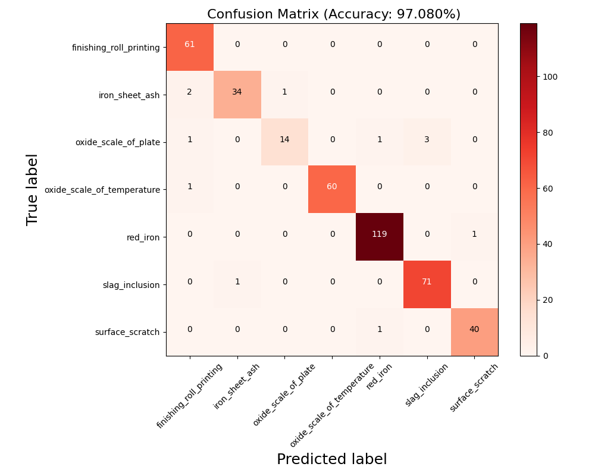

# Surface Defect Classification with ResNet
## Overview
This project focuses on the classification of surface defects using the ResNet18 architecture as the backbone. 
The goal is to accurately identify various types of surface defects in materials.

## Features
ResNet18 Backbone: Utilizes the powerful ResNet18 deep learning architecture for feature extraction and classification.
Seven-Class Classification: Capable of identifying seven distinct classes of surface defects.
Confusion Matrix Results: Evaluation of the model's performance is depicted through a detailed confusion matrix, highlighting its accuracy across different defect types.

## Results
The performance of the classification network on the training set using confusion matrix:

**Fig. 1:** Results on the training set.

The performance of the classification network on the test set using confusion matrix:

**Fig. 2:** Results on the test set.
